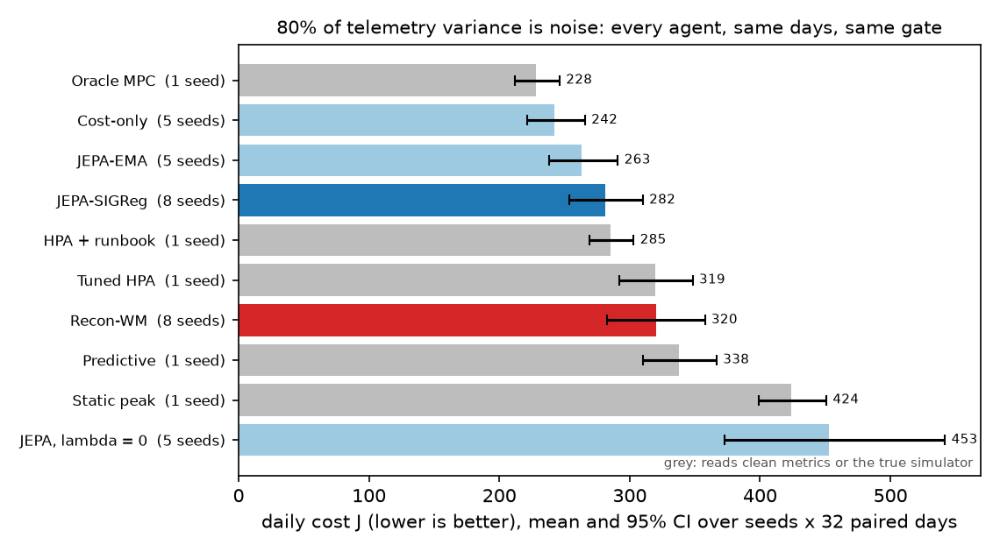

# NOISEFLOOR

**A governed SRE agent that plans inside a JEPA world model, tested against its own telemetry turning into noise.**

[](https://github.com/gandhiashutosh14/noisefloor/actions/workflows/ci.yml)


-blue)


> **In plain English:** an on-call engineer watches dashboards and decides when to add servers,
> shed traffic or fail over to another region. NOISEFLOOR is an agent that makes those decisions.
> It does not follow rules; it learns a compact internal picture of the service from telemetry,
> imagines what each plan would lead to over the next 40 minutes, and picks the cheapest one. Every
> action it takes passes through the same approval gate a human operator would face, and every
> decision is written to an audit log that can be replayed under a stricter policy. The question it
> was built to answer is the one real dashboards raise: what happens when most of what the agent
> sees is noise? The world is simulated, the method is published research (LeJEPA's SIGReg and
> LeWorldModel), and the experiment was pre-registered before any confirmatory run (the pilots that shaped the design are
> listed in the registration).

**Reading guide:** [results](#results) first if you want the answer. The next two sections say what
was built and why it matters; [the experiment](#the-experiment) says how it was tested. Engineers can go to [architecture](#architecture) and
[run it](#run-it). [What this does not claim](#what-this-does-not-claim) is not optional reading.

## The problem

Autoscaling on clean metrics is solved well enough: the Kubernetes Horizontal Pod Autoscaler reads
CPU or utilisation and adjusts replicas with a ratio and a tolerance. Real telemetry is not clean.
Batch jobs, garbage collection, noisy neighbours and deploys leak into every metric; most of the
variance on a busy dashboard has nothing to do with whether the service needs more capacity.

A learned agent has to decide what to pay attention to. There are two ways to train the compact
internal state it plans with:

- **Reconstruction** (autoencoders, the pixel decoders in Dreamer-style world models): keep whatever
  explains the most variance in what you see. If the noise is loud, the noise gets kept.
- **Joint-embedding prediction** (JEPA): keep whatever helps predict your own next internal state.
  Noise that cannot be predicted should be dropped, because keeping it only adds prediction error.
  LeJEPA (Balestriero and LeCun, 2025) made this trainable without the usual tricks (EMA teachers,
  stop-gradients) through one regulariser, SIGReg, which pushes the embeddings toward an isotropic
  Gaussian; LeWorldModel (2026) used it to plan from pixels.

NOISEFLOOR puts that argument to a controlled test in an operations setting, with a planner, a
governance gate and an audit trail around it, on a laptop CPU.

## What was built

| Layer | What it is | Where |
|---|---|---|
| World | A vectorised simulator of a web service: diurnal load, flash crowds, ramps, regional incidents; queueing latency (Sakasegawa M/M/c), client timeouts, error rates, replica warm-up, cache warmth, load shedding, failover. | `noisefloor/sim/` |
| Telemetry | 128 channels mixing 12 true-state features, plus 16 distractor sources leaking into every channel at a controlled share d of the pre-activation variance (nominal 0%, 50%, 80%, 95%; the z-scored input the models see carries about 6%, 65%, 84% and 94% noise, see RESULTS.md). Unpredictable by construction; a predictable arm and an isotropic arm test the premise. | `noisefloor/sim/telemetry.py` |
| Data platform | Offline trajectories in **Delta Lake** (delta-rs, no JVM), partitioned by noise level; every training run records the table versions it read and can be reproduced with time travel; the training loader refuses the true-state and distractor columns. | `noisefloor/data/` |
| World models | A JEPA world model with SIGReg (encoder, action-conditioned predictor, violation-risk head, inverse-dynamics head), and four controls trained with the same recipe: reconstruction, JEPA without SIGReg (collapse control), JEPA with an EMA teacher, and a value-equivalent cost-only model. | `noisefloor/models/` |
| Planner | Cross-entropy-method planning over 8-step action sequences in latent space. The actuator (replicas, cooldowns, action budget) is simulated exactly inside every imagined rollout under the gate's own limits, so a refused action is scored as a no-op and the ranked first actions are ones the gate accepts (fixed in v0.2: in the pre-registered run half the first choices were refused and the next candidate ran, see RESULTS.md). | `noisefloor/agents/wm_agent.py`, `noisefloor/plan/` |
| Governance | One gate for every agent, baselines included, using the capability-catalog schema of `governed-agent-orchestrator`: effect classes (reversible, compensable, irreversible), approval for failover, a shed cap with automatic restore, an action budget. | `noisefloor/govern/`, `configs/gate_v1.json` |
| Audit | Every decision is recorded in STERNWATCH envelope form with every candidate's verdict; in the audit job three days' worth are published to a Kafka-compatible log (AutoMQ in CI), rebuilt into a ledger from the log alone, and replayed under a stricter policy, action budget included, to list what would flip. | `noisefloor/audit/`, `.github/workflows/audit.yml` |
| Experiment tracking | MLflow runs per training and evaluation (params, metrics every 50 steps, probes, the encoder as a logged model), with one SQLite store per process; decision traces as MLflow spans (encode, plan, gate, act) for one evaluation day in eight. | `noisefloor/tracking.py` |
| Science | Pre-registered hypotheses, paired evaluation days, hierarchical bootstrap, seed-level t-intervals, TOST, Holm correction; the full grid runs in GitHub Actions. | `PREREGISTRATION.md`, `noisefloor/eval/`, `.github/workflows/grid.yml` |

## Architecture

```
            simulator (true state s_t)                     clean channels (baselines, approver)
                     |                                                  |
     telemetry o_t = softplus(A phi(s_t) + beta Q xi_t) + eps          |
                     |                                                  |
   +-----------------v------------------+                              |
   | encoder E: one frame -> z_t (16)   |   Delta Lake: trajectories,  |
   +-----------------+------------------+   observations by level,     |
                     |                      results, eval steps        |
   z_{t-2..t} -> predictor P (+ actuator u, action a) -> z_{t+1} ... z_{t+8}
                     |
   risk head R(z, u, a, depth) -> P(SLO violation);  cost = known(u, a) + 5 * P(violation)
                     |
   CEM over action sequences -> top-3 first actions --> gate (allow / deny / needs approval)
                                                          |              |
                                                   fleet executes    approver (1-step delay)
                                                          |
                                     STERNWATCH envelope -> log -> ledger -> replay under gate-v2
```

Design choices worth knowing, each with its reason in the code:

- **One-frame encoder.** With stacked frames the prediction target overlaps the input and i.i.d.
  noise becomes partly predictable. History lives in the predictor instead.
- **Learn only the hidden part of the cost.** Replica, shed, warm and failover costs are exact
  functions of the actuator state and the action; only the SLO-violation probability is learned.
  A regression head on the whole cost behaved like a median and priced rare violations as cheap.
- **Risk conditioned on rollout depth.** Deterministic rollouts regress toward typical states; each
  depth gets its own calibration against what actually happened that many steps later.
- **Mixed-quality offline data.** The behaviour operator's utilisation target is drawn per day from
  U(0.4, 1.3), so the data shows what running hot costs. With a single cautious operator every
  learned model concluded that scaling down was free.
- **No LLM anywhere.** The agent is a planner over a learned model; the gate is a catalog.

## The experiment

Pre-registered in [`PREREGISTRATION.md`](PREREGISTRATION.md) (tag `prereg-v1`) before any
confirmatory run, including every pilot and check that came before it and what each one changed.

- **Primary (H1):** with 80% of telemetry variance as unpredictable noise, the JEPA agent's daily
  cost is lower than the reconstruction agent's (8 training seeds x 32 paired days).
- **Sanity:** with no noise, the two are equivalent within 3%.
- **H2:** at 80% noise, JEPA beats a tuned HPA + runbook that reads clean metrics.
- **H3:** without SIGReg the latent collapses (effective rank <= 3 of 16); with it, it does not (>= 10).
- **Secondary (Holm-corrected):** JEPA vs reconstruction at 50% and 95% noise; JEPA vs an EMA teacher;
  JEPA vs a cost-only model; the predictable-noise falsification arm (JEPA's edge should shrink);
  the isotropic-noise arm.

Baselines: static peak provisioning, tuned Kubernetes HPA, HPA + runbook, a predictive autoscaler,
and an oracle that plans on the true simulator (a reference, not a bound). All rule baselines read
clean channels, a declared handicap in their favour. All agents face the same gate.

## Results

Pre-registered, then run once: 104 trained models and 3,920 evaluated days in 16 parallel GitHub
Actions jobs ([run 36489642311](https://github.com/gandhiashutosh14/noisefloor/actions/runs/36489642311)),
all on the tagged commit. Full tables, intervals and interpretation in [`RESULTS.md`](RESULTS.md).


| Pre-registered test | Result | Verdict |
|---|---|---|
| **H1 (primary):** at 80% noise, JEPA's daily cost below reconstruction's | 281.5 vs 320.0; difference -38.5, 95% CI [-56.6, -21.4], seed t-interval [-56.2, -20.8] | **supported** |
| Sanity: equivalent with no noise (within 3%) | 90% CI of the relative difference [-0.9%, +1.7%] | **equivalent** |
| H2: at 80% noise, JEPA beats the tuned runbook reading clean metrics | 281.5 vs 285.3; [-32.0, +25.7] | not supported (not distinguishable; the registered runbook also carried a bug, see below) |
| H3: latent collapses without SIGReg (rank <= 3 of 16), not with it (>= 10) | 5.5-6.2 without, 15.6-15.9 with | does not hold (partial collapse) |
| JEPA vs reconstruction at 50% / 95% noise; isotropic noise | -40.9 / -132.7; -21.5 (all intervals below zero) | supported |
| JEPA-SIGReg vs a cost-only latent (registered: JEPA lower) | +46.6: cost-only plans **better** | reversed |
| JEPA-SIGReg vs an EMA teacher (registered without a direction) | +25.5: the EMA teacher plans better | EMA lower |
| Predictable noise shrinks JEPA's edge | difference in differences -27.0 [-62.1, +2.5] | not supported |



What it adds up to:

- **As telemetry fills with noise, a JEPA world model keeps planning where a reconstruction model
  breaks down**, at the pre-registered latent width of 16: ahead at 50%, 80% and 95% noise, and
  equivalent without noise. On noisy telemetry it matched the registered runbook's cost, with 26%
  fewer replica-hours and more SLO-violation minutes; with the runbook's replica-count bug fixed
  (and, further, a health-aware approver) the runbook comes out 0.2-6.8 per day ahead of JEPA.
  So the honest reading is: as good as a well-configured runbook, not better.
- **SIGReg is not the best anti-collapse method for this job.** It keeps all 16 latent dimensions
  alive (rank 15.7), and the ones the state does not need fill with noise (distractor R^2 0.43). An
  EMA teacher learns a rank-7 code that carries more state (R^2 0.68) and almost no noise (0.045),
  and plans better (263.4; this comparison was registered without a direction). A latent shaped
  only by the violation-risk loss plans best of all the learned models (242.2, 75% of the gap to
  the oracle closed), reversing a registered prediction.
- **The result may be width-dependent.** In an exploratory ablation (3 seeds), reconstruction with a
  32-dimensional latent scored 266.0 against 297.1 for JEPA-SIGReg at the same width; the seed-level
  intervals include zero, so this is a lead for follow-up, not a result. A bottleneck effect at width
  16 (16 loud noise sources competing with the state for 16 dimensions) is the candidate explanation.
- Negative and reversed results are reported beside the positive one, as registered.


**Review and corrections (2026-09-29).** An independent code review after publication found two bugs
that favoured the learned agents (the rule baselines multiplied a stale utilisation by the current
replica count; the approver granted failover on overload) and one in the planner-gate interface
(the CEM ranked on proposed rather than effective actions, so the "denials" metric was an artifact),
plus mislabelled verdicts in the report. The pre-registered numbers stand as reported; the corrected
reference numbers, the definition of what `d` measures, and every fix are in
[`RESULTS.md`](RESULTS.md) ("Post-registration findings and corrections") and [`CHANGELOG.md`](CHANGELOG.md).

Audit trail: three evaluation days of a JEPA agent trained inside the audit job went through STERNWATCH on a
real AutoMQ 1.7.4 broker (MinIO-compatible object store) in CI ([`audit.yml`](.github/workflows/audit.yml), report in [`reports/audit-automq.md`](reports/audit-automq.md)). 861 decisions were published twice; the
ledger rebuilt from the log inserted 861 and ignored 861 duplicates, with no gaps. Replaying all 301
executed actions under a stricter policy (max 24 replicas, no failover) flipped none, because the
agent never needed more than 24 replicas or a failover on those days.

## Run it

CPU only. `noisefloor/__init__.py` hides CUDA before torch is imported.

```bash
python -m venv .venv && . .venv/bin/activate          # Windows: .venv\Scripts\activate
pip install torch==2.14.0 --index-url https://download.pytorch.org/whl/cpu
pip install -e ".[dev,audit]"
pytest -q                                             # 56 tests, ~25 s
noisefloor smoke                                      # data -> 200 training steps -> 2 governed days, ~30 s
noisefloor data                                       # the full lake: 250 days x 6 telemetry levels
noisefloor cell --variant jepa --d 0.8 --seed 0       # train + evaluate one model (~3 min)
noisefloor audit                                      # 3 days through STERNWATCH, replayed under gate-v2
python scripts/posthoc_baselines.py                   # the corrected baselines (post-registration analysis)
noisefloor grid --tier 2 --shard 0 --of 16            # one shard of the pre-registered grid
mlflow ui --backend-store-uri sqlite:///mlruns/local-0.db
```

## What this does not claim

- It is not Kubernetes. Actions are discrete, queueing latency is an approximation, prices are assumed.
- The distractors are independent of the state by construction. A result shows the mechanism works
  where that premise holds, not that real dashboards look like this.
- No claim about JEPA against reconstruction in general, on pixels, or at scale: this is a 16-dimensional
  latent, MLPs, and 57,000 transitions.
- It is not reinforcement learning: the data is offline and comes from one family of behaviour operators.
- Approvals are simulated, the gate is not a safety proof, and the oracle is not optimal.
- Cells with 3 seeds are descriptive only.
- The rule baselines in the pre-registered run carried a replica-count bug and an error-only approver;
  corrected reference numbers are reported post hoc in RESULTS.md, and the registered ones are not replaced.
- The behaviour policy chose actions from clean channels, so actions carry hidden-state information into
  the offline data; action-effect estimates are biased, for both learned models alike.
- `d` is the distractor share of the pre-activation signal on the behaviour data; the model input's noise
  share is higher (RESULTS.md, "What d measures").

## Project layout

```
noisefloor/
  sim/        fleet.py (dynamics, actuator, costs)  loads.py  telemetry.py (distractor worlds)
  data/       collect.py (behaviour data, rendering)  lake.py (Delta Lake tables, leak guard)
  models/     nets.py  sigreg.py  train.py (five variants, one recipe)
  plan/       cem.py  oracle.py
  agents/     rules.py (HPA, runbook, predictive, static)  wm_agent.py (latent CEM)
  govern/     gate.py (catalog, constraints, budget)  approver.py
  audit/      envelopes.py (STERNWATCH)  replay.py (ledger replay under gate-v2)
  eval/       harness.py  run.py  probes.py  stats.py  report.py
  grid.py  cli.py  tracking.py (MLflow)
configs/      sim.json  grid.json  gate_v1.json  gate_v2.json
docs/         DESIGN_SPEC.md (the pre-build spec the registration refers to)
scripts/      pilot.py  plan_check.py  diagnose.py  plan_variants.py  benchmark.py  posthoc_baselines.py
reports/      pilot/ (every pre-registration round)  benchmark.json  posthoc-baselines.json  audit-automq.md
CHANGELOG.md  what changed after the pre-registered run, and why
```

## SWOT analysis

| | Helpful | Harmful |
|---|---|---|
| **Internal** | **Strengths:** pre-registered, paired, multi-seed design with the whole grid run in public CI on the tagged commit; a primary result with both intervals clear of zero, reported beside a reversed secondary, a failed hypothesis and a post-publication review whose findings are disclosed with numbers; a full stack around the model (lake, tracking, gate, audit), not a notebook; CPU-only, about 4 CPU-hours for the complete grid. | **Weaknesses:** a simulated world; small models and a 16-dimensional latent; offline data from one operator family; the rule baselines read clean metrics, so "beats the runbook" compares unequal inputs by design. |
| **External** | **Opportunities:** the finding that SIGReg's isotropy stops a model from discarding noise suggests testable fixes (a smaller latent chosen by validation, SIGReg on a projection, a rank-adaptive target); the same harness can test any representation objective or planner on the same paired days; the audit path works with any Kafka-compatible log. | **Threats:** results in a synthetic world can be over-read; the headline depends on latent width (exploratory ablation); SIGReg compresses rare spikes (pilot probes), which are the events operations care about most. |

## Where this applies

- **Autoscaling and capacity management** when the signals are noisy or partly irrelevant.
- **Any control loop with telemetry** (databases, queues, CDNs) where an agent must separate signal from noise before acting.
- **Governed autonomy**: agents whose every action passes a policy gate and leaves a replayable record.
- **Evaluating world-model objectives** on a cheap, controlled benchmark before spending GPU hours.

## Glossary

| Term | Meaning |
|---|---|
| World model | A learned model that predicts how a system's state changes after an action, used to imagine outcomes before acting. |
| JEPA | Joint-Embedding Predictive Architecture: learn by predicting the embedding of the future, not the raw future. |
| SIGReg | Sketched Isotropic Gaussian Regularisation: pushes random 1-D projections of the embeddings toward a standard normal, which prevents collapse. |
| Collapse | A representation that maps everything to (nearly) the same point; trivially predictable and useless. |
| Effective rank | How many dimensions a set of embeddings really uses (1 = collapsed, 16 = all). |
| CEM | Cross-entropy method: sample action plans, keep the best, resample around them, repeat. |
| MPC | Model-predictive control: plan ahead, take the first action, re-plan next step. |
| HPA | Kubernetes Horizontal Pod Autoscaler. |
| SLO | Service-level objective (here: p95 latency under 250 ms, errors under 1%). |
| Delta Lake | An open table format with ACID transactions and time travel over Parquet files. |
| Pre-registration | Fixing hypotheses and analysis before seeing the data that tests them. |
| TOST | Two one-sided tests: shows two things are equivalent within a margin. |
| Holm correction | Adjusts p-values when several hypotheses are tested together. |

## Further reading

- Balestriero and LeCun, *LeJEPA: Provable and Scalable Self-Supervised Learning Without the Heuristics*, arXiv 2511.08544.
- Maes et al., *LeWorldModel*, arXiv 2603.19312, and code at github.com/lucas-maes/le-wm (MIT).
- Assran et al., *V-JEPA 2*, arXiv 2506.09985; Assran et al., *I-JEPA*, arXiv 2301.08243.
- Sobal et al., *PLDM*, arXiv 2502.14819; Hansen et al., *TD-MPC2*, arXiv 2310.16828; Zhou et al., *DINO-WM*, arXiv 2411.04983; Hafner et al., *DreamerV3*, arXiv 2301.04104.
- Stone et al., *The Distracting Control Suite*, arXiv 2101.02722.
- Kubernetes documentation, *Horizontal Pod Autoscaling*; Google SRE book, *Service Level Objectives*.

## License

MIT. See [`LICENSE`](LICENSE) and [`NOTICE.md`](NOTICE.md) for what is reimplemented from where.
