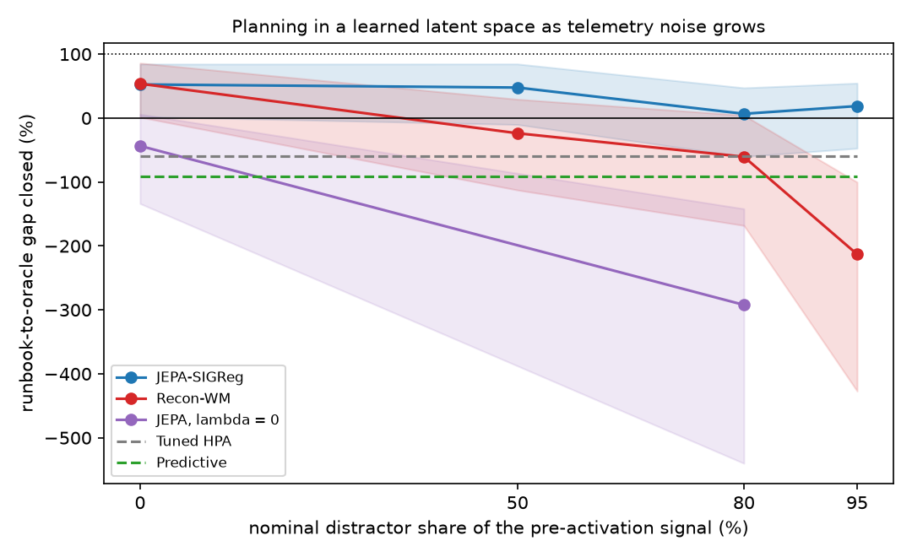
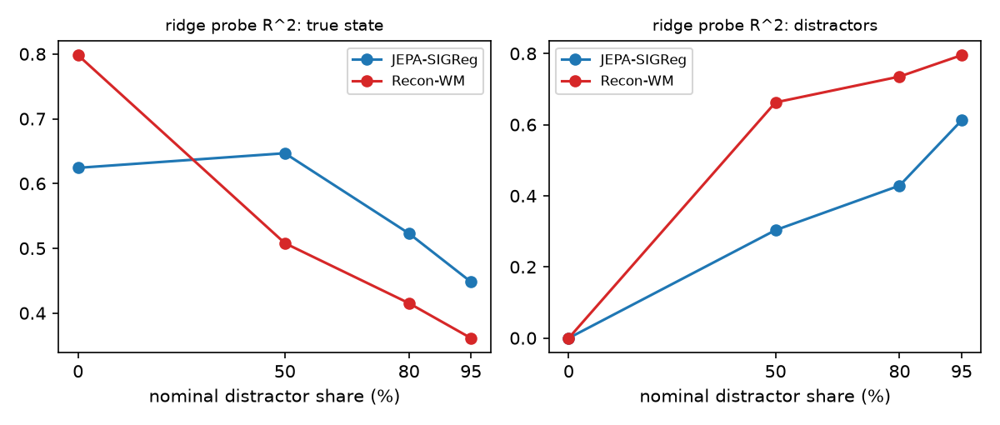

# NOISEFLOOR results

Generated 2026-09-29 18:54 UTC from commit `c90c402` under pre-registration tag `prereg-v1`; data hash c1565fe2e1f02689; 32 paired evaluation days per cell.

Command: `noisefloor report --lake lake-all --out . --prereg prereg-v1  (re-rendered on 2026-09-30 from the run's tables with the v0.2 report code; numbers unchanged, labels corrected)`

## Table at d = 0.8 (nominal share; see the note on what d measures)

| model | seeds | J [95% CI] | IQM | gap closed | SLO-violation min/day | replica-h/day | dJ vs Recon [95% CI] |
|---|---|---|---|---|---|---|---|
| Static peak | 1 | 423.7 [399.2, 450.7] | 385.1 | -242% [-441, -147] | 51 | 620 | - |
| Tuned HPA | 1 | 319.5 [292.2, 348.2] | 303.6 | -60% [-160, -8] | 55 | 441 | - |
| HPA + runbook | 1 | 285.3 [268.8, 303.0] | 284.9 | 0% [0, 0] | 23 | 418 | - |
| Predictive | 1 | 337.5 [310.0, 366.6] | 320.4 | -91% [-210, -33] | 60 | 463 | - |
| Recon-WM | 8 | 320.0 [282.8, 357.6] | 317.3 | -61% [-168, 4] | 127 | 298 | - |
| JEPA, lambda = 0 | 5 | 452.6 [372.5, 541.8] | 412.0 | -292% [-540, -142] | 255 | 266 | 116.1 [44.2, 192.7] |
| JEPA-EMA | 5 | 263.4 [238.1, 290.9] | 237.3 | 38% [-25, 75] | 57 | 331 | -73.2 [-108.8, -40.4] |
| Cost-only | 5 | 242.2 [221.4, 265.6] | 229.0 | 75% [34, 106] | 50 | 301 | -94.3 [-124.3, -66.1] |
| JEPA-SIGReg | 8 | 281.5 [253.7, 310.0] | 275.0 | 7% [-60, 47] | 85 | 309 | -38.5 [-56.6, -21.4] |
| Oracle MPC | 1 | 228.1 [211.7, 246.2] | 220.6 | 100% [100, 100] | 48 | 278 | - |

Rule baselines and the oracle read clean utilisation, latency and error channels (a declared handicap in their favour) and do not depend on d. Gap closed = (J_runbook - J) / (J_runbook - J_oracle).

## Pre-registered hypotheses

- **H1 (primary)**, J_JEPA - J_Recon < 0 at d = 0.8: -38.5 [-56.6, -21.4] (bootstrap), seed t-interval [-56.2, -20.8]: **supported**.
- **Sanity**, equivalence within 3% at d = 0: 90% interval of the relative difference [-0.9%, 1.7%]: **equivalent**.
- **H2**, J_JEPA - J_runbook < 0 at d = 0.8: -3.8 [-32.0, 25.7]: **not supported (interval includes 0)**.
- **H3**, effective rank of lambda = 0 <= 3 and of SIGReg >= 10 (of 16): lambda = 0 [6.0, 5.6, 5.5, 6.2, 5.6, 5.7, 5.7, 5.5, 5.8, 6.1], SIGReg [15.6, 15.7, 15.7, 15.8, 15.8, 15.6, 15.9, 15.7, 15.7, 15.6, 15.6, 15.6, 15.6, 15.7, 15.7, 15.8, 15.8, 15.8, 15.8, 15.8, 15.8, 15.9, 15.7, 15.6, 15.8, 15.7]: **does not hold**.

Secondary comparisons. Verdicts follow the registered direction of each test and require the Holm-adjusted p to be below 0.05; a comparison registered without a direction only reports which side is lower. 3-seed cells are descriptive.

| comparison (candidate - reference) | registered direction | mean [95% CI] | seed t-interval | Holm p | verdict |
|---|---|---|---|---|---|
| jepa_vs_recon_d50 | candidate lower | -40.9 [-66.9, -20.7] | [-66.3, -15.5] | < 0.0001 | supported |
| jepa_vs_recon_d95 | candidate lower | -132.7 [-191.5, -87.5] | [-215.3, -50.0] | < 0.0001 | supported |
| jepa_vs_ema_d80 | none | 25.5 [6.6, 49.4] | [12.7, 38.3] | 0.0116 | reference lower (no direction was registered) |
| jepa_vs_costonly_d80 | candidate lower | 46.6 [29.4, 66.2] | [33.0, 60.3] | < 0.0001 | reversed |
| did_predictable_minus_main | candidate higher | -27.0 [-62.1, 2.5] | [-67.3, 13.4] | 0.0838 | not supported (interval includes 0) |
| jepa_vs_recon_isotropic_d80 | candidate lower | -21.5 [-36.0, -9.6] | [-39.1, -4.0] | < 0.0001 | supported |

## What the latent codes contain

| model | d | state R^2 | distractor R^2 | effective rank | 4-step error / latent variance | models |
|---|---|---|---|---|---|---|
| JEPA-SIGReg | 0.00 | 0.624 | -0.000 | 15.8 | 0.08 | 8 |
| JEPA-SIGReg | 0.50 | 0.647 | 0.303 | 15.6 | 0.28 | 5 |
| JEPA-SIGReg | 0.80 | 0.523 | 0.429 | 15.7 | 0.44 | 8 |
| JEPA-SIGReg | 0.95 | 0.448 | 0.612 | 15.7 | 0.71 | 5 |
| Recon-WM | 0.00 | 0.798 | -0.000 | 11.9 | 0.18 | 8 |
| Recon-WM | 0.50 | 0.508 | 0.663 | 13.6 | 0.45 | 5 |
| Recon-WM | 0.80 | 0.415 | 0.735 | 14.5 | 0.64 | 8 |
| Recon-WM | 0.95 | 0.361 | 0.795 | 15.0 | 0.80 | 5 |
| JEPA, lambda = 0 | 0.00 | 0.657 | -0.000 | 5.7 | 0.05 | 5 |
| JEPA, lambda = 0 | 0.80 | 0.559 | 0.043 | 5.9 | 0.18 | 5 |
| JEPA-EMA | 0.80 | 0.675 | 0.045 | 6.9 | 0.13 | 5 |
| Cost-only | 0.80 | 0.598 | 0.153 | 9.8 | 0.92 | 5 |

## Exploratory cells (descriptive; not tested)

| cell | model | seeds | J [95% CI] |
|---|---|---|---|
| d = 0.8, latent 8 | JEPA-SIGReg | 3 | 293.8 [261.9, 326.9] |
| d = 0.8, latent 32 | JEPA-SIGReg | 3 | 297.1 [262.6, 333.3] |
| predictable noise, d = 0.8 | JEPA-SIGReg | 5 | 301.4 [268.2, 340.7] |
| isotropic noise (128 sources), d = 0.8 | JEPA-SIGReg | 5 | 284.9 [258.5, 312.3] |
| d = 0.8, latent 8 | Recon-WM | 3 | 400.4 [366.3, 434.9] |
| d = 0.8, latent 32 | Recon-WM | 3 | 266.0 [239.7, 294.3] |
| predictable noise, d = 0.8 | Recon-WM | 5 | 376.0 [341.4, 410.8] |
| isotropic noise (128 sources), d = 0.8 | Recon-WM | 5 | 306.4 [276.1, 338.7] |

## Unseen load shapes (launch plateau, double spike) at d = 0.8

- JEPA-SIGReg: J 270.1 [252.6, 287.8], gap closed 84% [77, 92]
- Recon-WM: J 283.4 [258.9, 306.9], gap closed 68% [43, 93]
- HPA + runbook: J 341.0 [324.3, 356.7]
- Oracle MPC: J 256.7 [236.1, 277.6]
- Tuned HPA: J 291.1 [278.0, 305.4]

Planning horizon 4 instead of 8 (JEPA, d = 0.8): J 334.9 [292.8, 379.4], difference 39.4 [21.9, 60.6] (horizon 8 on the same 3 seeds: 295.4 [264.3, 327.9]).

Realised over planned 8-step cost at d = 0.8 (above 1 means the planner was optimistic): Cost-only 1.15, JEPA-EMA 1.10, JEPA-SIGReg 1.15, JEPA, lambda = 0 1.65, Recon-WM 1.25. Above the 1.5 threshold the design set for a planner that exploits model error: JEPA, lambda = 0.

Planning time per environment (one batched CEM call divided by the number of environments run in lockstep; p50 and p99 over the 287 calls of a day, averaged over seeds): JEPA-SIGReg 2.74 ms (p99 2.91; 32 environments), Recon-WM 2.63 ms (p99 2.79; 32 environments).

---

*Everything above this line was generated by `noisefloor report` from the tables of the grid's
aggregate job ([run 36489642311](https://github.com/gandhiashutosh14/noisefloor/actions/runs/36489642311)):
104 trained models and 3,920 evaluated days, all on commit `c90c402` (tag `prereg-v1`), one data hash.
It was first rendered on 2026-09-28 22:21 UTC, 22 minutes after the tag (2026-09-28 21:59 UTC; both
dates are 2026-09-29 in the author's time zone), and re-rendered on 2026-09-30 with the corrected
report code described under "Deviations". Everything below is interpretation and post-registration
analysis, written after reading it.*

## Deviations from the pre-registration

The grid itself ran once, on the tagged commit, with the registered configs; no analysis code or
config changed between the tag and the run. Three things changed afterwards, in the reporting, and
are disclosed here:

1. **Verdict labels.** The report code at the tag labelled any significant difference "supported" or
   "reversed" from the sign alone, ignoring the direction registered for each secondary test, and it
   printed Holm-adjusted p-values without using them. Under the registered rules, JEPA vs EMA (no
   direction registered) is "reference lower", not "reversed"; a *positive* difference-in-differences
   was the prediction for the predictable arm. The tables above are re-rendered with the corrected
   labels; every number is unchanged.
2. **Presentation.** The exploratory cells, the planning-latency line and the planner-optimism flag
   are now emitted by the report code (they were hand-typed in the first version of this file, and
   the latency line was wrong: it said 2.9 ms and 16 environments; the run used 32 environments in
   lockstep and the median is 2.74 ms).
3. **Post-registration analysis** below: two bugs found in a code review of 2026-09-29 affect the
   rule baselines and the planner-gate interface. The registered results stand as reported; the
   corrected reference numbers are reported beside them, not instead of them.

## What d measures

`d` is the distractor share of the mean channel variance of the pre-activation signal
u = A·phi(s) + beta·Q·xi, over the *behaviour-data* states. That is what the code calibrates,
exactly. The models see softplus(u) plus a small observation noise, z-scored per channel, and
those transformations change the share: on the training days the input's noise share is 0.06 /
0.65 / 0.84 / 0.94 at nominal d = 0 / 0.5 / 0.8 / 0.95 (measured by re-rendering the same states with
independent noise draws), with individual channels from 18% to 100% noise at d = 0.8, and the "no
noise" level carries about 6% from the observation noise (45% on one channel). On evaluation days,
which are steadier than the behaviour data, the share is higher again. So "80% noise" is a design
label for a level whose model input is closer to 85% noise; "dropping channels removes nothing" is
not true, though no channel is clean. None of this changes the comparisons, which are paired
within each level.

## What the results say

1. **The primary hypothesis holds.** At nominal d = 0.8 the JEPA agent's daily cost is 38.5 lower
   than the reconstruction agent's (281.5 vs 320.0, 12%; bootstrap 95% CI [-56.6, -21.4], seed
   t-interval [-56.2, -20.8]; 8 seeds x 32 paired days; negative for all 8 seeds). With no noise
   the two are equivalent within 3%. JEPA is ahead at every noisy level tested: -40.9 at 50%,
   -38.5 at 80% and -132.7 at 95%, where reconstruction degrades to 407 and JEPA only to 275. It also
   holds when the noise is spread over all 128 directions (-21.5). Both learned agents share every
   flaw the review found (below), so the contrast between the two objectives is a fair one.

2. **JEPA on noisy telemetry did not beat the runbook (H2 not supported), and the registered
   runbook was weaker than it should have been.** Registered: 281.5 vs 285.3, interval [-32.0,
   +25.7]. The post-registration re-run of the baselines (below) puts the runbook at 281.3 with its
   replica-count bug fixed and at 274.7 with a health-aware approver as well. JEPA gets there
   differently: 26% fewer replica-hours per day (309 vs 418) and more SLO-violation minutes (85 vs
   23). On unseen load shapes it did better than the runbook (270.1 vs 341.0), but OOD was
   exploratory and not tested.

3. **SIGReg is not the best way to stop collapse here.** A JEPA with an EMA teacher (263.4) and a
   model whose encoder is shaped only by the violation-risk loss (242.2, 75% of the gap closed)
   both plan better than JEPA-SIGReg at d = 0.8: the cost-only result reverses a registered
   prediction; the EMA comparison was registered without a direction and simply favours EMA. The
   probes show why: SIGReg pushes every direction of the 16-dimensional latent toward a unit
   Gaussian, so the latent uses all of it (effective rank 15.7) and whatever is not needed for the
   state fills with noise (distractor R^2 0.43). The EMA model settles on a low-rank code (rank 6.9)
   that carries more of the state (R^2 0.68) and almost none of the noise (0.045).

4. **Collapse control (H3 fails on its lower half).** Without SIGReg (lambda = 0) the latent shrinks
   to rank 5.5-6.2, not to the registered <= 3: the inverse-dynamics loss, which reaches the encoder
   in every variant, keeps it from collapsing fully (the risk loss is detached from the encoder in
   this variant, so it plays no part). Effective rank is scale-free, so it cannot tell a shrunk code
   from a spread one; the run's tables did not record the latent's scale (v0.2 records it). In a
   reviewer's re-trained lambda = 0 model the latent std was 0.10 against 0.93 for JEPA-SIGReg.

5. **The falsification arm did not behave as predicted.** When the distractors are predictable, a
   predictive objective has reason to encode them, so JEPA's edge should shrink. The latent does
   encode them (distractor R^2 0.74), but reconstruction suffers more (376.0 vs 301.4), and the
   difference in differences (-27.0, interval [-62.1, 2.5]) is not distinguishable from zero.

6. **The latent-width ablation qualifies H1, as a hypothesis.** In 3-seed exploratory cells,
   reconstruction with a 32-dimensional latent scored 266.0 against 297.1 for JEPA-SIGReg at the same
   width and 295.4 for JEPA-SIGReg at width 16 on the same three seeds (the 8-seed mean is 281.5).
   The seed-level intervals of both contrasts include zero ([-89.7, +27.5] and [-62.1, +3.2] for
   recon-32 minus JEPA-32 and minus JEPA-16), so this is a lead, not a result: reconstruction's
   failure at width 16 may be a bottleneck effect (16 loud distractor sources competing with the
   state for 16 dimensions), and JEPA-SIGReg puts extra width into noise (rank 28, distractor R^2
   0.73 at width 32).

## Planning quality

At d = 0.8 the realised 8-step cost was 1.15x what JEPA's planner expected (reconstruction 1.25x,
EMA 1.10x, cost-only 1.15x), under the 1.5 threshold the design set for "the planner exploits model
error". **The lambda = 0 planner was at 1.65x, above the threshold**: as the pre-registration said it
would be, that is reported, not fixed; the lambda = 0 agent is also the worst learned agent (452.6).
A planning step (CEM, 128 samples, 3 iterations, 8-step horizon) took a median 2.74 ms per
environment for JEPA with 32 environments in lockstep on the CI runner's CPU (p99 2.91 ms).

## Post-registration findings and corrections (review of 2026-09-29)

An independent code review after publication found, and the author reproduced, the following.
Numbers come from `reports/posthoc-baselines.json` (script `scripts/posthoc_baselines.py`, run on
the same 32 evaluation days with the v0.2 code); the learned agents' published day-level costs
are not re-run.

- **The rule baselines multiplied a stale utilisation by the current replica count.** Utilisation
  is measured on the replicas that served the step; replicas that finished warming up during that
  step were counted as if they had served it, so on 6.6% of decisions HPA over-estimated demand by
  up to 1.6x and then flapped. Kubernetes sizes demand from the count the metric was measured on.
  Corrected and re-tuned: tuned HPA 315.8 (was 319.5), runbook 281.3 (was 285.3), predictive 327.0
  (was 337.5) per day. With the corrected runbook, JEPA-SIGReg's "gap closed" at d = 0.8 is -0.4%
  (published: 7%), EMA 34% (38%), cost-only 73% (75%), reconstruction -73% (-61%).
- **The approver granted failover on any error spike, including plain overload.** The runbook's 16
  failovers on the 32 days were 8 on incident days and 8 on flash-crowd days, where the region was
  healthy and a failover (cost 20) could not help. With an approver that also requires degraded
  region health the runbook scores 274.7 (8 failovers, all on incident days) and the oracle,
  re-run with the v0.2 planner, 231.0. Against those references JEPA-SIGReg's gap closed is -16%,
  EMA 26%, cost-only 74%. The registered environment is kept as the pre-registered one; v0.2 offers
  the health-aware approver as an option (`Approver(require_degraded_health=True)`).
- **The planner handed the gate proposed actions, not the ones that would run.** Rollouts score a
  gate-refused action as a no-op, but the CEM ranked and de-duplicated on the raw sampled action,
  so refused actions tied with no-op plans and often led the list: 48.6% of the learned agents'
  first choices were refused by the gate, and in 1.9% of decisions the harness executed a fallback
  the planner had rated worse. The "denials" metric in the tables (JEPA 206/day, reconstruction 247,
  oracle 70, against runbook 8) is mostly this artifact; it drops to 0 when the ranking uses the
  effective action. The cost effect was within noise on 16 days (-10.6, sd 19.1), so H1 is not in
  question. Fixed in v0.2.
- **Behaviour actions carry hidden-state information.** About 70% of the behaviour policy's actions
  came from an HPA reading the clean channels, so "scale up" correlates with high load, and the
  risk head learned a depth-0 effect for scale-up that is physically impossible (a scale-up cannot
  change the current step), worth about a third of that action's replica cost. Both learned models
  share it; action-effect estimates are biased, most at high d. A limitation of the offline data,
  stated here rather than fixed.
- **Smaller corrections in v0.2:** the shed metric under-reported the billed shed level by a third;
  churn counted the wrong events; decision records kept only the last verdict, so failover requests
  never reached the audit envelopes; frames right after a behaviour-policy replica reset were
  internally inconsistent and 2% of training windows started on one; a planner-side failover
  request assumed approval and the harness could count an approval whose failover the gate then
  refused; the gate and the planner's mask came from different sources of truth; the audit replay
  ignored the action budget; the MLflow decision traces the README described were never wired in.
  See `CHANGELOG.md`. None of these changes the pre-registered numbers, which come from the tagged
  code.
